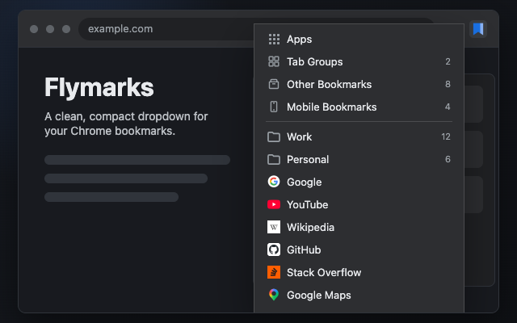

# Flymarks

Flymarks is a lightweight Chrome extension that shows bookmarks as a clean and compact dropdown menu, with folder navigation, context actions, and bookmark operations.

It is open source so you can verify that it does not send your bookmark data anywhere.



## Quick Start

Install Flymarks from the [Chrome Web Store](https://chromewebstore.google.com/detail/flymarks/eohdjjkolomidnfbaacmccggllinijng).

For local development, install the unpacked extension into your main Google Chrome profile:

1. Open `chrome://extensions/` in Google Chrome.
2. Enable Developer mode.
3. Click Load unpacked.
4. Select this repository folder.
5. Open the toolbar action named `Flymarks`.

After code changes, return to `chrome://extensions/` and click Reload on the `Flymarks` card. If the card shows an Errors button, inspect whether the errors are current or stale, clear stale errors, and reload the extension to verify the button stays gone.

## Development

Automated tests run in [Chrome for Testing](https://developer.chrome.com/blog/chrome-for-testing), not your main Chrome profile.

Install Chrome for Testing:

```bash
npx @puppeteer/browsers install chrome@stable --path ~/.cache
```

Run tests:

```bash
npm test
```

Launch a manual test browser:

```bash
npm run browser
```

### Agent Workflow

If you use Codex or Claude Code, this project pairs well with the optional [Chrome Extension skill](https://github.com/sbaranov/chrome-extension-skill). The skill captures the Chrome extension testing, packaging, screenshot, privacy, and Chrome Web Store workflow used by this repo.

## Publishing

Create a Chrome Web Store upload package:

```bash
npm run package
```

This writes `dist/flymarks.zip` with `manifest.json` at the archive root.
