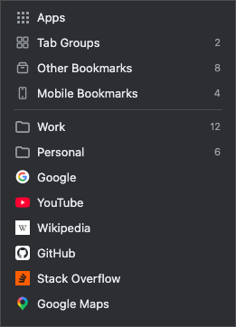

# Bookmarks Menu

Bookmarks Menu is a simple Chrome extension that shows bookmarks as a clean and compact dropdown menu, with folder navigation, context actions, and bookmark operations.

It is open source so you can verify that it does not send your bookmark data anywhere.



## Quick Start

Install the development extension into your main Google Chrome profile:

1. Open `chrome://extensions/` in Google Chrome.
2. Enable Developer mode.
3. Click Load unpacked.
4. Select this repository folder.
5. Open the toolbar action named `Bookmarks Menu`.

After code changes, return to `chrome://extensions/` and click Reload on the `Bookmarks Menu` card. If the card shows an Errors button, inspect whether the errors are current or stale, clear stale errors, and reload the extension to verify the button stays gone.

## Development

Automated tests run in **Chrome for Testing**, not your main Chrome profile.

Required tools on macOS:

- `node` (Node 20+ recommended)

Install Chrome for Testing:

```bash
version=$(curl -fsSL https://googlechromelabs.github.io/chrome-for-testing/LATEST_RELEASE_STABLE)
curl -fL "https://storage.googleapis.com/chrome-for-testing-public/$version/mac-arm64/chrome-mac-arm64.zip" -o /tmp/chrome-mac-arm64.zip
unzip -q -o /tmp/chrome-mac-arm64.zip -d /tmp/chrome-for-testing
rm -rf "$HOME/Applications/Google Chrome for Testing.app"
mv "/tmp/chrome-for-testing/chrome-mac-arm64/Google Chrome for Testing.app" "$HOME/Applications/"
```

Run the E2E test suite in Chrome for Testing with an isolated temporary profile:

```bash
npm test
```

Launch Chrome for Testing for manual testing using a reusable persistent profile:

```bash
npm run browser
```

## Publishing

Create a Chrome Web Store upload package:

```bash
npm run package
```

This writes `dist/bookmarks-menu.zip` with `manifest.json` at the archive root.

## Browser Testing Architecture Notes

This section documents the key constraints and decisions behind the E2E browser test environment.

### 1. Stable Google Chrome is not suitable for unpacked-extension automation here

- Stable Google Chrome logs: `--load-extension is not allowed in Google Chrome, ignoring.`
- Impact: the extension is not loaded, so popup/extension targets are unavailable to CDP.
- Mitigation: use **Chrome for Testing** for E2E runs.

### 2. Keychain prompt behavior

- macOS prompts for Keychain access when launching browser automation.
- Impact: if access is denied, browser startup can fail.
- Mitigation: always launch Google Chrome for Testing with `--use-mock-keychain`.

### 3. CDP transport requirement in Node

- The test runner requires WebSocket support for CDP.
- Mitigation: use Node with `--experimental-websocket`.

### 4. Extension ID discovery

- The test runner first finds the extension ID through Chrome DevTools Protocol targets.
- If the extension service worker is not visible yet, it falls back to the generated profile metadata.

### 5. Flake-resistance patterns in tests

- Use polling for async bookmark operations (e.g., delete verification) instead of fixed short sleeps.
- Use a dynamically allocated free remote-debugging port per run to avoid collisions.
- Synthetic drag-and-drop via CDP can be unreliable; deterministic test hooks are used for reorder verification.
